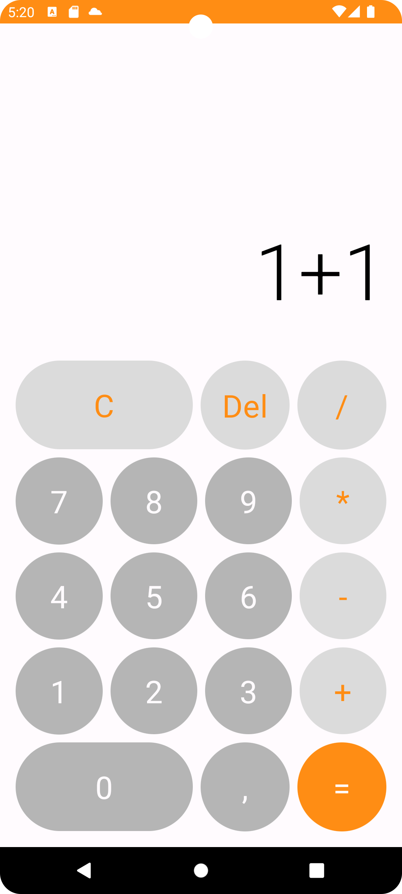
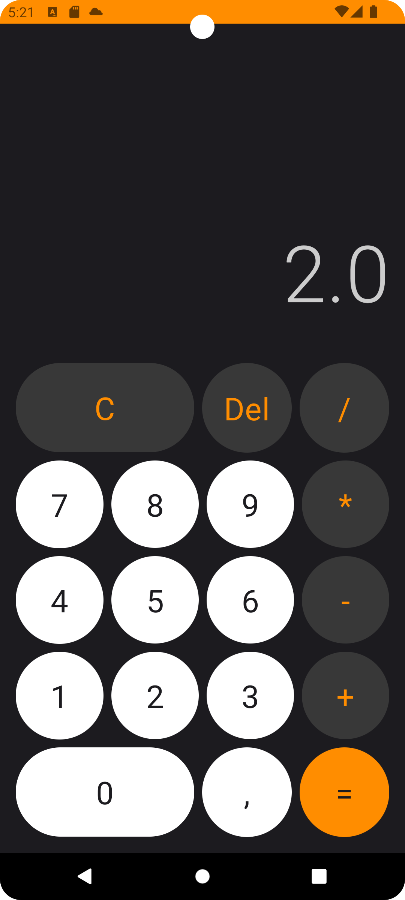

## Compose Calculator
A simple calculator app built using Android Studio & Jetpack Compose.

 

This project has been made using the following tutorial. It is just an example in order for me to get practice on Compose & Kotlin.
Credits goes to [Philipp Lackner](https://youtu.be/-aTcFJWxEQA)

